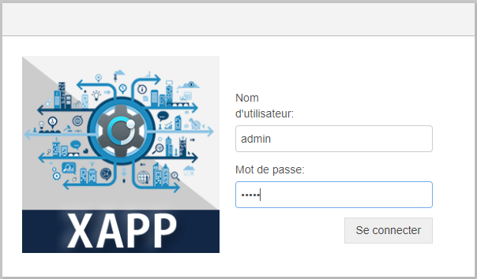

# Welcome To XAPP

XAPP est une solution innovante conçue pour moderniser les processus industriels en offrant une gestion simplifiée des systèmes MES. XAPP permet une acquisition, un traitement, et une visualisation en temps réel des données de production, accessibles à tout moment et depuis n'importe où.

  

# Déploiement de l'application Web
Pour déployer l'application Web de XAPP sur votre serveur local ou distant, suivez les étapes ci-dessous :

# Déploiement de l'application Mobile

[def]: https://nodered.org/images/node-red-screenshot.png